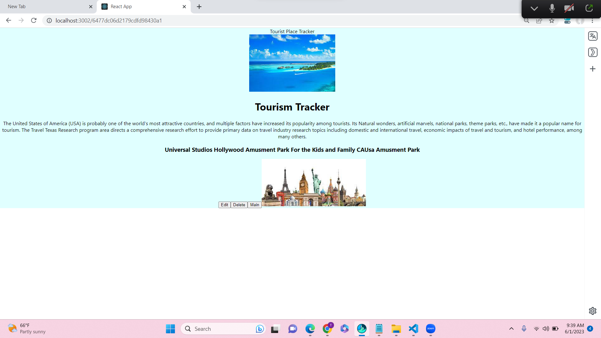

# Project’s Title:  Tour Tracker<br>
Frontend Link: [Project live link]( https://mern-backend-2byb.onrender.com)


Backend Link: [Project live link]( https://mern-backend-2byb.onrender.com)

In this project we have all the data for the Best place in the world for tourism and famous place according to the category like Amusement Parks, Historic Places, Beaches,Hikings all the data we will be storing in the Moongo DataBase System. We have all the Edit Delet And Create option so that we can update all our tourism Experience in the Project. This is the MERN project , I have added all the CRUD Features of the Mern Project. I have deployed front end in React and Backend in Express, Deployed in the Render. 
Create, update, Delete features are enabled in the application.

##  Description:<br>



(-)
## How to Use Your Project: 
### Installing React
Firstly, install the React framework globally using NPM so that it can be used to create a web application using node terminal.
Save the above code in a file named  and run it with the following command.
npx create-react-app my-app
cd my-app
npm start
>npx create-next-app
___
## front End import { BrowserRouter as Router, Routes, Route } from 'react-router-dom'
>import './App.css'
>import EditTour from './components/EditTour';
>import Tour from './components/Tour'
>import Tours from './components/Tours'

```python
function App() {
  return (
    <div className="App">
      Tourist Place Tracker
      <Router>
        <Routes>
        <Route path='/' element={<Tours/>}/>
        <Route path='/:id' element={<Tour/>}/>
        <Route path='/:id/edit' element={<EditTour/>}/>
        </Routes>
        
      </Router>
      
    </div>
  );
}

```
export default App;


 ### $ node server.js<br>
 
Data Base   From the Express  Backend 
const mongoose = require('mongoose');

>const placeSchema = new mongoose.Schema({
   > name: { type: String, required: true },
    >about: { type: String, required: true },
    >state: { type: String, required: true },
    >country: { type: String, required: true },
    >category: { type: String, required: true },
    >Like: { type: Boolean },
    >image: { type: String }

>}, { timestamps: true });

>const Place = mongoose.model('Place', placeSchema);

>module.exports = Place;


## Techonology Used
React for Front End.
Moongo DB Data Base  Backend
express for backend.
CSS for Styling.
Java Script
Html
React for Front End.

### `npm start`

Runs the app in the development mode.\
Open [http://localhost:3000](http://localhost:3000) to view it in your browser.

The page will reload when you make changes.\
You may also see any lint errors in the console.

### `npm test`

Launches the test runner in the interactive watch mode.\
See the section about [running tests](https://facebook.github.io/create-react-app/docs/running-tests) for more information.

### `npm run build`

Builds the app for production to the `build` folder.\
It correctly bundles React in production mode and optimizes the build for the best performance.

The build is minified and the filenames include the hashes.\
Your app is ready to be deployed!

See the section about [deployment](https://facebook.github.io/create-react-app/docs/deployment) for more information.

RenderDashboard is the best option for the DEployment of the Project.


## Include Credits:
I thank All my Friend for helping me and for Good suggestions. Like to have suggestions from friends to improve my app. Thank for my Mentors to help me completing the project.<br>

## Motivation and Future Inhancement: 
I like Tours and Travell and that motivated me to develop this Project. I would like to include some more feature in the project where i will like to have rating feature in the project where people can rate the application.<br>
### Author 

Thanks 
TR---li


